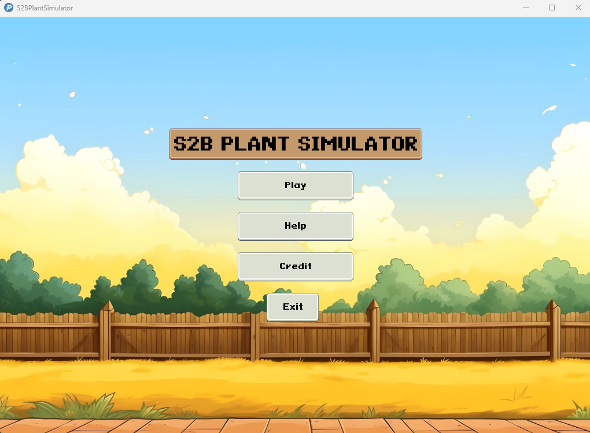
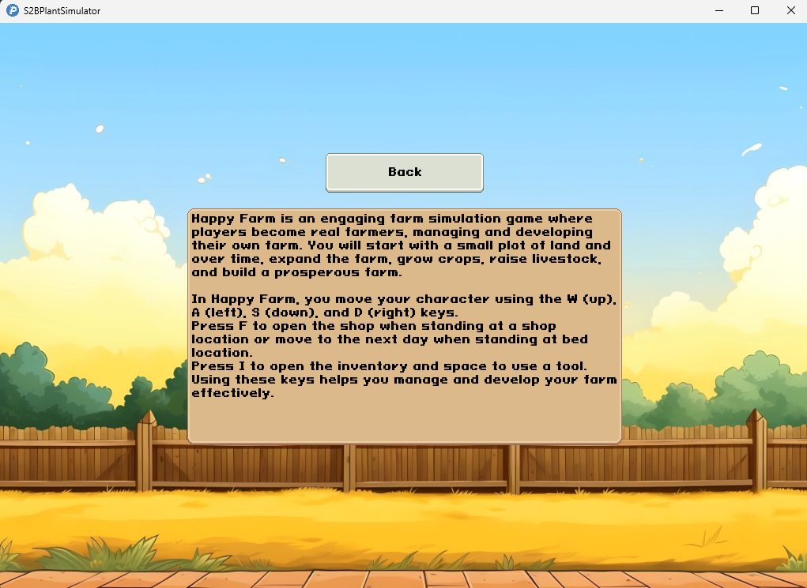
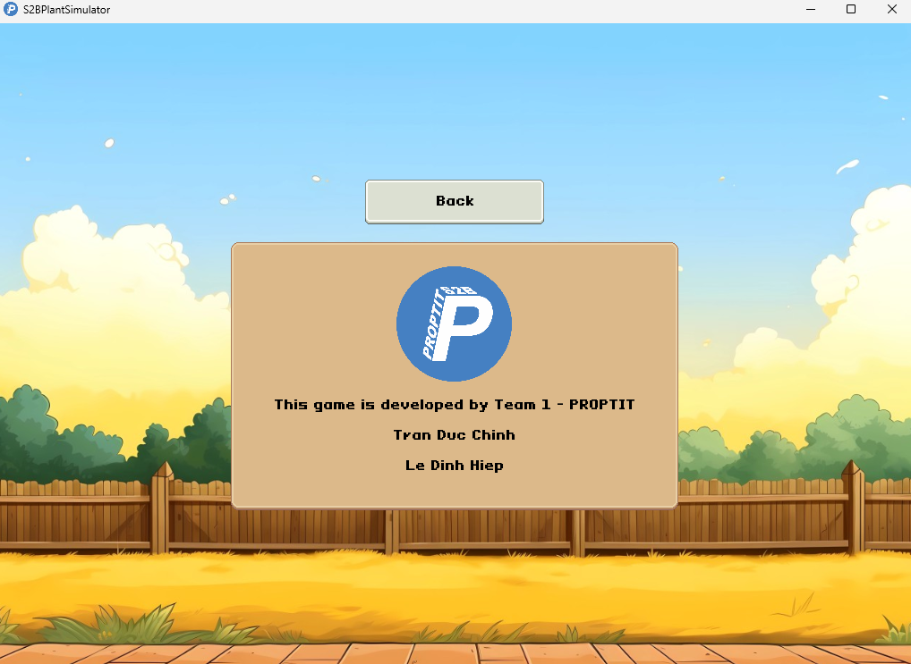
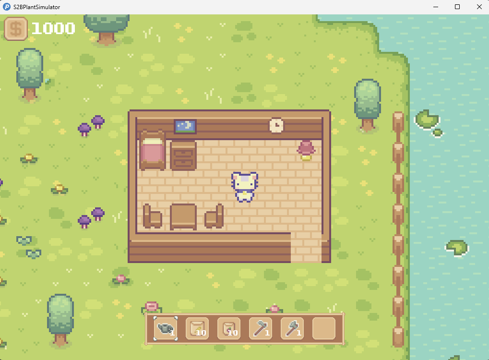
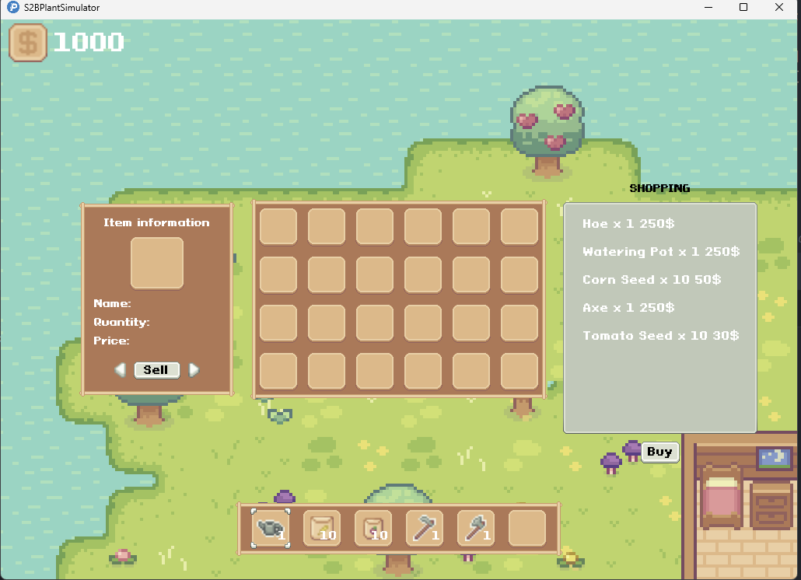
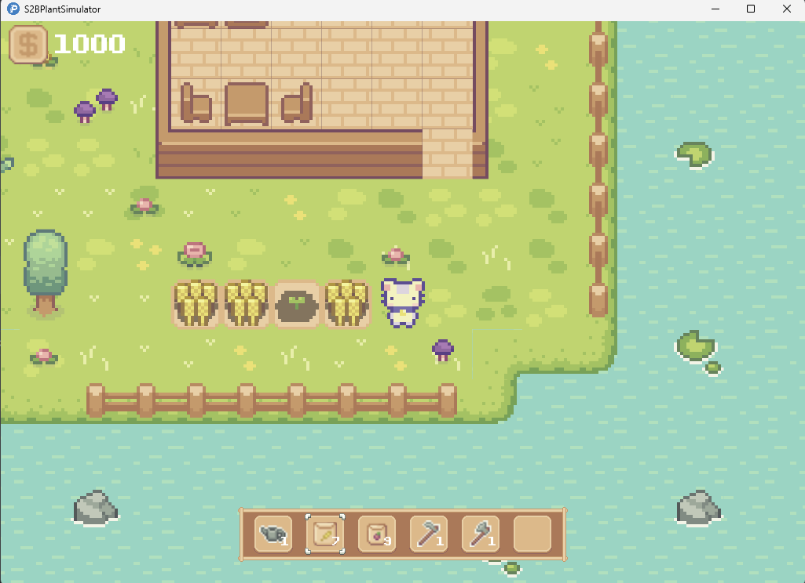
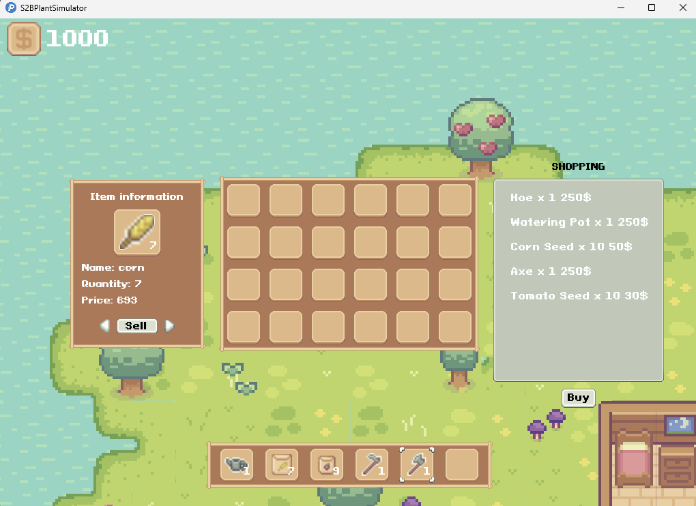

# Mẫu Báo Cáo Kết Quả Bài Tập Code Game

## 1. Thông Tin Nhóm

**Tên Dự Án:** **S2B Plant Simulator**

**Link Dự Án:** [GitHub Link](#)

**Thành Viên Nhóm:**
- [Trần Đức Chính](https://www.facebook.com/tdczin04)
- [Lê Đình Hiệp](https://www.facebook.com/hey.incognito)
- [Mentor: Nguyễn Nam Hải](https://www.facebook.com/profile.php?id=61556015135973)


### Mô hình làm việc

Team hoạt động theo mô hình Scrum, sử dụng Linear để quản lý công việc. Các công việc được keep track đầy đủ trên Linear.
- Link linear: [Nhóm 1](https://linear.app/bdtproptit/team/NHOM1/all)

Mỗi tuần, team sẽ ngồi lại để review công việc đã làm, cùng nhau giải quyết vấn đề và đề xuất giải pháp cho tuần tiếp theo. Sau đó sẽ có buổi demo cho mentor để nhận phản hồi và hướng dẫn.

### Version Control Strategy


Team hoạt động theo Gitflow để quản lý code. Mỗi thành viên sẽ tạo branch từ `develop` để làm việc, các branch đặt theo format `feature/ten-chuc-nang`, sau khi hoàn thành sẽ tạo Pull Request để review code và merge vào develop
- Các nhánh chính:
  - `master`: Chứa code ổn định, đã qua kiểm tra và test kỹ lưỡng
  - `develop`: Chứa code mới nhất, đã qua review và test
  - `feature/`: Các nhánh chứa code đang phát triển, short-live, sau khi hoàn thành sẽ merge vào `develop`. 


Sau mỗi tuần, team sẽ merge `develop` vào `master` để release phiên bản mới.


## 2. Giới Thiệu Dự Án

**Mô tả:** Xây dựng một game mang thiên hướng giải trí nhẹ nhàng. Người chơi sẽ được hoá thân thành anh nông dân chăm chỉ cày cuốc trồng trọt để kiếm tiền thông qua hệ thống shop bán nông sản.

## 3. Các Chức Năng Chính

- Trồng trọt
- Shop bán hàng
- Chuyển ngày thông qua việc đi ngủ

## 4. Công nghệ

### 4.1. Công Nghệ Sử Dụng
- [Java 8](https://www.java.com/en/download/help/java8.html)
- [LibGDX](https://libgdx.com/)
- [Gradle](https://gradle.org/)
- [Thư viện Box2d](https://box2d.org/about/)
- [Skin Composer](https://libgdx.com/wiki/tools/skin-composer)
- ...

### 4.2 Cấu trúc dự án

```
- assets 
  - button
  - fruit
  - Skin
  - images
  - sounds
  - newMap.tmx
- core
  - common.constant
  - controller
  - inventory
  - loader
  - model
  - screens
  - sound
  - transition
  - ultis
  - view
- desktop
- ios
...
```

Diễn giải:
- **assets:** Chứa các tài nguyên như hình ảnh, âm thanh
- **core:** Chứa các class chính của game như model, view, controller
- **desktop, ios, android:** Chứa các class để chạy trên các nền tảng khác nhau"
- ...


## 5. Ảnh và Video Demo

**Ảnh Demo:**















**Video Demo:**
[S2B Plant Simulator](https://youtu.be/hGaCLpr7idY)


## 6. Các Vấn Đề Gặp Phải

### Vấn Đề 1: Lỗi khi sử dụng remove trong forEach

### Hành Động Để Giải Quyết

**Giải pháp:** Sử dụng removeIf để xử lý loại bỏ các phần tử không cần thiết để 

### Kết Quả

- Không còn xuất hiện bug

### Vấn Đề 2: Tình trạng giật lag game khi tạo quá nhiều object và mỗi object lại thực hiện lấy tài nguyên một lần
**Ví dụ:** Có quá nhiều object Dirt và mỗi object này lại thực hiện khởi tạo 1 tài nguyên Texture mới


### Hành Động Để Giải Quyết

**Giải pháp:** Sử dụng Flyweight Design Pattern để tái sử dụng lại tài nguyên Texture nếu nó đã tồn tại và thực hiện tạo mới nếu nó chưa tồn tại

### Kết Quả

- Sau khi sử dụng Flyweight Design Pattern, game không còn tình trạng giật lag không còn xuất hiện.

## 7. Kết Luận

**Kết quả đạt được:** Mọi luồng chạy trở lên ổn định, hiện tại chưa ghi nhận thêm bugs

**Hướng phát triển tiếp theo:** Tương lai có thể sẽ làm thêm chức năng chặt cây, câu cá ...